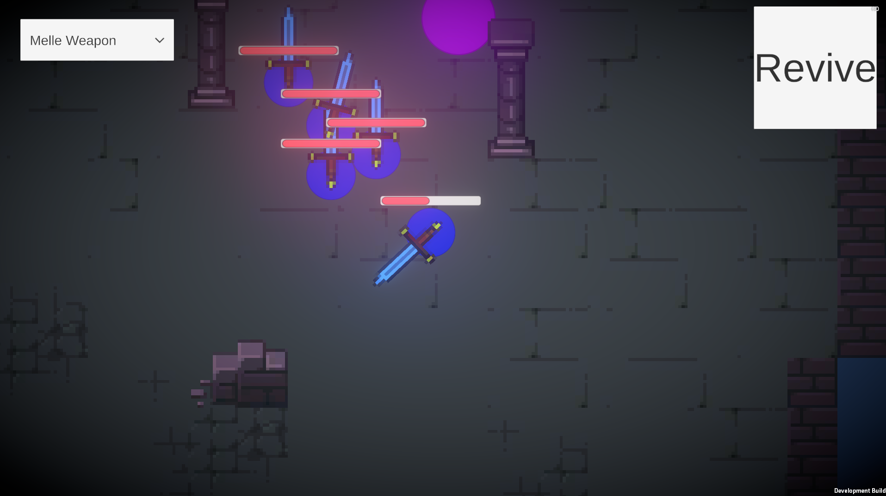

# Top-Down 2D Shooter in Unity

Простой top-down шутер с управлением WASD, системой оружия и врагами с разным поведением. Все параметры настраиваются через Scriptable Objects.

- **Игрок** с настраиваемыми HP/скоростью, оружием ближнего/дальнего боя
- **Главный враг (NPC_1)**: убегает от игрока, спавнит мобов по таймеру
- **Мобы (NPC_2)**: преследуют игрока, контактный урон
- Система урона с визуальной индикацией
- Ограниченная игровая карта
- Полная настройка всех параметров через Inspector

## 🛠 Технологии:
- 
- 
- 

